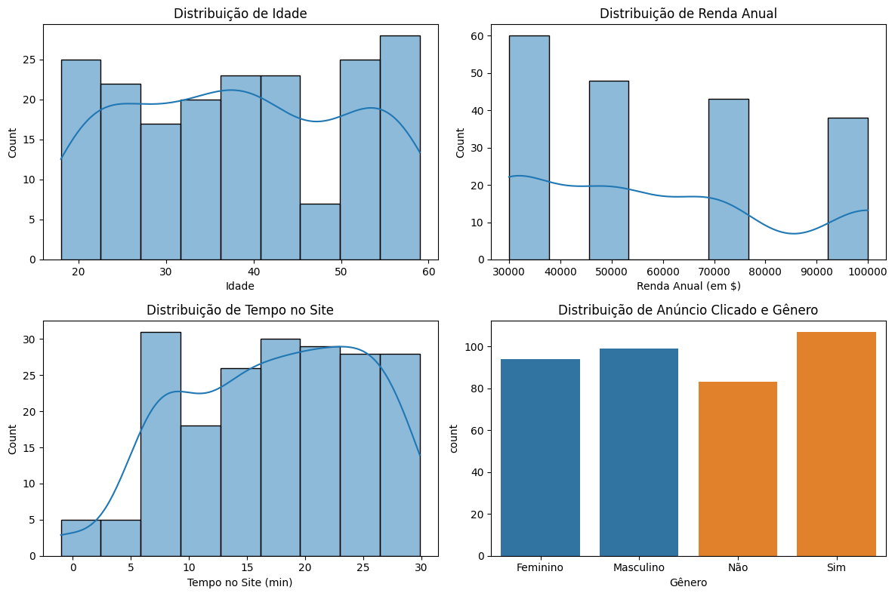
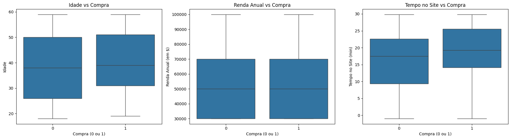
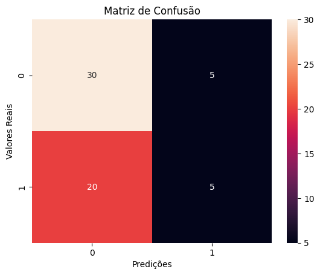
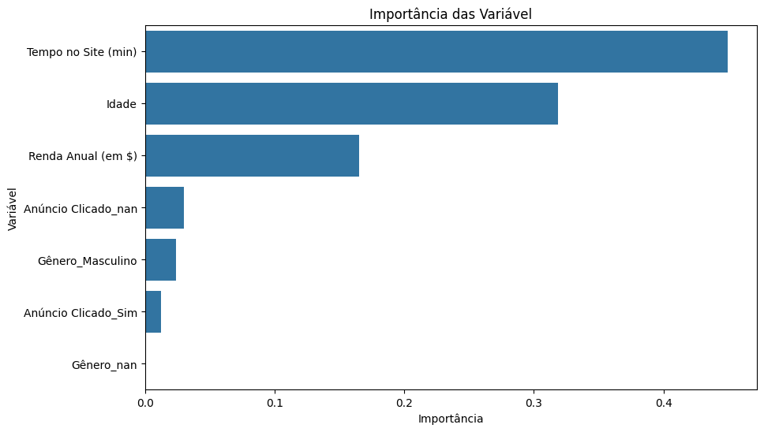

# Desafio Prático Ciência de Dados VExpenses

> O objetivo é avaliar suas habilidades em análise de dados, aplicação de métodos de classificação e interpretação de resultados. Você trabalhará com um dataset fictício contendo informações de perfis de usuários de um site imobiliário e deverá prever se um usuário realizará a compra de uma casa ou não com base nas informações disponíveis.

# Introdução

O projeto tem como objetivo construir um modelo de classificação capaz de prever a compra do usuário a partir dos dados de acessos ao site de vendas do ramo imobiliário, para que seja possível, a partir do modelo, que as áreas de negócios promovam estratégias eficientes.
Estrutura do Dataset
O dataset contendo as informações dos acessos ao site de vendas possui as seguintes características:
Total de registros: 200
Total de colunas: 6
Formato: csv 

# 1. Análise Exploratória dos Dados 

Nessa fase inicial do projeto, foi utilizado métodos estatísticos(estatística descritiva, curva de densidade de Kernel) e programação (bibliotecas de análise de dados em python) para analisar o dataset fornecido a fim de conhecer as suas características, qualidades e nível de integridade dos dados. Assim como, as correlações e distribuições entre as variáveis. A fim de avaliar os dados de forma crua, não foram feitos normalizações e padronização nesses dados, então há diferenças de abordagem entre as variáveis numéricas e categoricas, como na matrix de correlação e gráficos bloxpots que apresenta somente as variáveis númericas. 

---

| Variável        | Categoria   | Frequência | Proporção (%) |
|-----------------|-------------|------------|---------------|
| Gênero          | Masculino   | 99         | 49.5          |
| Gênero          | Feminino    | 94         | 47.0          |
| Anúncio Clicado | Sim         | 107        | 53.5          |
| Anúncio Clicado | Não         | 83         | 41.5          |
----
| Variável            | Frequência | Média    | Moda  | Mediana | Desvio Padrão | Mínimo | Máximo   |
|---------------------|------------|----------|-------|---------|---------------|---------|-----------|
| Idade               | 190        | 38.51    | 19    | 38      | 12.68        | 18      | 59        |
| Renda Anual (em $)  | 189        | 58254    | 30000 | 50000   | 25612.1      | 30000   | 100000    |
| Tempo no Site (min) | 200        | 17.35    | -1    | 18.20   | 7.72         | -1      | 29.85     |
| Compra (0 ou 1)     | 200        | 0.33     | 0     | 0       | 0.47         | 0       | 1         |

## 1.1 Distribuição das variáveis (idade, renda, tempo no site, etc.).

- **Idade:** A distribuição da variável 'Idade' é uniforme em todas as faixas etárias com mínimo e máximo de 18 a 59 anos respectivamente. Exceto, na faixa que corresponde a 45-50 anos em que há a menor densidade de registros.Enquanto na faixa de 20-25 e 50 - 60 há maiores densidades, o que revela uma tendência comportamental há procura por imóveis nessas idades.

- **Renda Anual:** A distribuição da variável Renda Anual (em $) revela uma maior concentração nas rendas de 30.0000 a 50.0000 mil reais.Enquanto a densidade entre a faixa de 70.000 a 100.000 é a menos expressiva.

- **Tempo no Site (min)**: A densidade nessa variável se concentra na faixa de 15 a 25 minutos. Revelando que os clientes tendem a ficar um tempo relativamente médio no site.Enquanto que uma menor distribuição de 0 até 5, pode revelar que os clientes planejam quando vão acessar o site e o fazem em seus tempos livres.

- **Genero**: a distribuição dessa variável é mostra que nenhum dos gêneros possui forte participação nos acessos.

- **Anúncio Clicado**: a distribuição revela uma discreta para cliques nos anúcios, mostrando uma aceitação positiva da campanha veiculado, mas, com muita margem para aumento nessa aceitação geral. 

| Variável        | Categoria   | Frequência | Proporção (%) |
|-----------------|-------------|------------|---------------|
| Gênero          | Masculino   | 99         | 49.5          |
| Gênero          | Feminino    | 94         | 47.0          |
| Anúncio Clicado | Sim         | 107        | 53.5          |
| Anúncio Clicado | Não         | 83         | 41.5          |
----
| Variável            | Frequência | Média    | Moda  | Mediana | Desvio Padrão | Mínimo | Máximo   |
|---------------------|------------|----------|-------|---------|---------------|---------|-----------|
| Idade               | 190        | 38.51    | 19    | 38      | 12.68        | 18      | 59        |
| Renda Anual (em $)  | 189        | 58254    | 30000 | 50000   | 25612.1      | 30000   | 100000    |
| Tempo no Site (min) | 200        | 17.35    | -1    | 18.20   | 7.72         | -1      | 29.85     |
| Compra (0 ou 1)     | 200        | 0.33     | 0     | 0       | 0.47         | 0       | 1         |

**Insights Identificados:** 
- Faixas etárias predominantes (20-25 e 55-60 anos) devem ser alvos prioritários.
- A renda média da base analisada sugere um público de classe média a média-baixa.
- O tempo médio no site reflete um engajamento razoável, mas otimizações podem ser feitas para manter usuários por mais tempo.
- A eficácia dos anúncios parece positiva, especialmente com uma alta taxa de cliques mas há margem para criar estratégia de melhorias.

## 1.2 Possíveis relações entre as variáveis independentes e a variável alvo (Compra)

 A fim de destacar as possíveis correlações entre as variáveis foi usado uma matriz de correlação de Pearson e gráficos boxplots que revela essas tendências. 
 A matriz de correlação de Pearson é caracterizado por um valor númerico de -1 a 1, em que 1 e -1 corresponde a uma correlação linear perfeita e 0 como sendo nenhuma correlação linear, característica também presente no boxplots. Esses método foram escolhidos por terem a capacidade de revelar, mesmo dentre um grande conjunto de dado, as tendências de correlações de forma simplificada e direta.

|    | Variável            |   Correlação com a Variável Alvo |
|---:|:--------------------|---------------------------------:|
|  0 | Compra (0 ou 1)     |                             1.00 |
|  1 | Tempo no Site (min) |                             0.15 |
|  2 | Idade               |                             0.11 |
|  3 | Renda Anual (em $)  |                            -0.04 |
---

**Insights Identificados:** 
**Tempo no Site:** Clientes que passam mais tempo no site têm maior probabilidade de realizar compras, indicando que o engajamento no site é um fator importante.
**Idade:** Clientes mais velhos têm uma ligeira tendência a comprar, sugerindo oportunidades para campanhas direcionadas a esse público.
**Renda Anual:**  A renda apresenta uma relação fraca e negativa com a probabilidade de compra, indicando que outros fatores são mais relevantes na decisão.
**Ausência de Correlações Fortes:**  Nenhuma variável analisada isoladamente possui uma forte correlação com a compra, sugerindo que fatores combinados ou as outras variáveis tenham correlações mais fortes

## 1.3 Identificação de Valores Ausentes ou Inconsistências nos Dados
 
 Essa etapa de identificação de ausentes e inconsistências. foi realizada para identificar valores ausentes e entradas inválidas no conjunto de dados. Essa localização é importante para definir as medidas a serem tomadas na fase de limpeza de dados Para isso foi utilizado um script em python que identifica cada tipo de inconsistência e um script que retorna uma tabela com resumo dos dados ausentes. 

### Pipeline Script de Identificação

**Valores Ausentes**
- Verifica se há valores não numéricos em colunas esperadas como numéricas (Idade, Renda Anual, Tempo no Site) utilizando uma função personalizada is_not_numeric.
Registra valores inconsistentes únicos encontrados.
**Variáveis Numéricas:**
- Verifica se há valores não numéricos em colunas esperadas como numéricas (Idade, Renda Anual, Tempo no Site) utilizando uma função personalizada is_not_numeric.
**Variáveis Categóricas:**
- Compara os valores das variáveis categóricas (Gênero, Anúncio Clicado) com os valores esperados, definidos previamente no dicionário variaveis_esperadas.
Identifica valores que não pertencem ao conjunto esperado e registra os valores únicos inconsistentes.
Registra valores inconsistentes únicos encontrados.
**Variável Binária:**
- Valida se os valores da coluna binária Compra (0 ou 1) estão restritos a 0 e 1. Valores fora desse conjunto são classificados como inconsistentes.

**Idade:** Possui 10 valores ausentes (5%), o que pode influenciar na análise de correlações e nas distribuições dessa variável.
**Renda Anual:** Registrou 11 valores ausentes (5,5%), uma proporção que pode impactar a análise de renda como fator de decisão de compra.
**Tempo no Site:** Apenas 2 valores ausentes (1%), sendo uma inconsistência menos significativa, mas ainda relevante para a modelagem.
**Compra (0 ou 1):** Não apresenta valores ausentes, o que é positivo, já que essa é a variável alvo do estudo.

### Estratégias de Tratamento Sugeridas

1. **Valores Ausentes:**
- Substituir valores ausentes pela média ou mediana da variável (para variáveis numéricas como "Idade" e "Renda Anual").
- Para variáveis categóricas (se existirem), preencher com a moda ou uma categoria "Desconhecido".

2. **Inconsistências:**

- Corrigir valores negativos ou inconsistentes ("Tempo no Site") utilizando a média ou a mediana.
- Avaliar e excluir registros com inconsistências graves, se necessário.

# 2. Pré - Procesamento do Dados

O tratamento de valores ausentes e o pré-processamento de dados são etapas essenciais para assegurar a qualidade e a confiabilidade das análises e modelos preditivos. Essas práticas evitam distorções nos resultados ao preencher valores ausentes com estratégias adequadas, como a mediana para variáveis numéricas e a moda para categóricas, preservando consistência e coerência nos dados. Para isso foi utilizado um script em python que trata de forma estatégica os dados para aprendizado

### 2.1 Tratamento de Valores Ausentes e Pré-Processamento dos Dados

**Estratégias de Tratamento Aplicadas**  

1. **Preenchimento de Valores Numéricos**  
   - Para as variáveis numéricas, como *Idade*, *Renda Anual* e *Tempo no Site*, os valores ausentes foram preenchidos com a mediana de cada coluna.  
   - A escolha da mediana foi baseada em sua robustez contra outliers, garantindo que a distribuição dos dados não ficasse distorcida.

2. **Preenchimento de Valores Categóricos**  
   - No caso das variáveis categóricas, como *Gênero* e *Anúncio Clicado*, os valores ausentes foram preenchidos com a moda, ou seja, o valor mais frequente em cada coluna.  
   - Essa abordagem assegurou a consistência entre as categorias, preservando o equilíbrio nos dados.

3. **Normalização das Variáveis Numéricas**  
   - Após o preenchimento dos valores ausentes, foi aplicado o processo de normalização às variáveis numéricas, utilizando a técnica de *Standard Scaler*.  
   - Esse método transformou os dados para que apresentassem média igual a 0 e desvio padrão igual a 1, evitando que variáveis em escalas distintas influenciassem de forma desproporcional nas análises ou nos modelos preditivos.

**Resultado do Tratamento**  
- Todos os valores ausentes foram preenchidos de maneira consistente, garantindo a integridade do dataset.  
- As variáveis numéricas foram normalizadas, promovendo homogeneidade para análises futuras e melhor desempenho em algoritmos de machine learning.  
- O dataset encontra-se agora preparado para as análises subsequentes ou aplicação em modelos preditivos, com maior confiabilidade e qualidade nos dados tratados.  

| Variável            |   Total de Registros |   Registros Válidos |   Valores Ausentes |   Proporção de Ausentes (%) |
|:--------------------|---------------------:|--------------------:|-------------------:|----------------------------:|
| Idade               |                  200 |                 200 |                  0 |                           0 |
| Renda Anual (em $)  |                  200 |                 200 |                  0 |                           0 |
| Gênero              |                  200 |                 200 |                  0 |                           0 |
| Tempo no Site (min) |                  200 |                 200 |                  0 |                           0 |
| Anúncio Clicado     |                  200 |                 200 |                  0 |                           0 |
| Compra (0 ou 1)     |                  200 |                 200 |                  0 |                           0 |

# 2.2 Realização de Codificação para Variáveis Categóricas

Variáveis categóricas, como *Gênero* e *Anúncio Clicado*, não podem ser utilizadas diretamente em modelos preditivos, pois são representadas como texto. A fim de resolver o problema foi , o script converte essas variáveis em representações numéricas por meio de *One-Hot Encoding*, permitindo sua integração no modelo a ser construido. Esse método foi escolhido para esse projeto por transforma variáveis categóricas em vetores binários, preservando completamente a distinção entre diferentes categorias e Diferentemente de outros métodos como Label Encoding, que atribui números inteiros às categorias, o OneHotEncoding evita introduzir uma falsa ordem ou relação entre categorias, garantindo que cada uma seja tratada como um valor independente.

### Pipeline Script de Identificação

1. **Utilização do OneHotEncoder**  
   - O *OneHotEncoder* transforma cada categoria de uma variável categórica em colunas binárias (0 ou 1), criando uma representação numérica única para cada categoria.  
   - A opção `drop='first'` foi utilizada para evitar multicolinearidade, removendo uma das categorias de cada variável categórica.

2. **Criação do DataFrame Codificado**  
   - Após o encoding, os resultados foram armazenados em um novo DataFrame (`encoded_categoricals_df`), com colunas nomeadas a partir das categorias originais.

3. **Integração com o Dataset Principal**  
   - O DataFrame com as variáveis codificadas foi concatenado ao dataset preprocessado original.  
   - As variáveis categóricas originais foram removidas para evitar redundâncias.

Após a execução do script:  
- As variáveis categóricas foram transformadas em colunas binárias numericamente interpretáveis.  
- O dataset resultante contém apenas variáveis numéricas, estando completamente preparado para análises e modelagem preditiva.

### Início DataFrame após codificação:

|     Idade |   Renda Anual (em $) |   Tempo no Site (min) |   Compra (0 ou 1) |   Gênero_Masculino |   Gênero_nan |   Anúncio Clicado_Sim |   Anúncio Clicado_nan |
|----------:|---------------------:|----------------------:|------------------:|-------------------:|-------------:|----------------------:|----------------------:|
| -0.769462 |            -1.11633  |             -1.50652  |                 0 |                  0 |            0 |                     0 |                     0 |
|  1.58314  |            -0.313215 |              0.588781 |                 0 |                  0 |            0 |                     1 |                     0 |
|  0.934144 |             0.489901 |             -1.45725  |                 1 |                  0 |            0 |                     0 |                     0 |
| -1.41846  |             1.69457  |             -0.140714 |                 0 |                  0 |            0 |                     0 |                     0 |
|  1.66426  |            -0.313215 |              1.41297  |                 1 |                  0 |            0 |                     1 |                     0 |

# 2.3 Dividir os dados em conjuntos de treino e teste.

A divisão dos dados em conjuntos de treino e teste é uma etapa crucial na construção de modelos preditivos. Essa separação permite que o modelo seja treinado em uma parte dos dados e avaliado em outra, garantindo uma validação imparcial de seu desempenho, ou seja, dividir os dados em um conjunto de treinamento e teste permite avaliar a capacidade do modelo de generalizar para novos dados não vistos.

### Pipeline Script de Identificação

1. **Separação das Variáveis**  
   - O código separa as variáveis independentes (*X*) da variável dependente ou alvo (*y*).  
   - No dataset preprocessado:  
     - *X* contém todas as colunas, exceto a variável alvo *Compra* (0 ou 1).  
     - *y* contém apenas a variável alvo, indicando se uma compra foi realizada.

2. **Divisão dos Dados**  
   - O método `train_test_split` da biblioteca *sklearn* é utilizado para dividir os dados em conjuntos de treino e teste.  
   - Configurações aplicadas:  
     - **Proporção**: 70% dos dados para treino e 30% para teste.  
     - **Random State**: `random_state=42` garante que a divisão seja reproduzível, permitindo a obtenção dos mesmos resultados em execuções futuras.

3. **Informações dos Conjuntos**  
   - Após a divisão, as dimensões de cada conjunto são verificadas para garantir que a separação foi realizada corretamente:  
     - *X_train* e *y_train*: Conjuntos utilizados para treinar o modelo.  
     - *X_test* e *y_test*: Conjuntos utilizados para avaliar o modelo.

O dataset foi dividido com sucesso, permitindo que o modelo seja treinado e avaliado de forma imparcial. As dimensões de cada conjunto foram exibidas para confirmar que a divisão foi realizada na proporção correta, assegurando a integridade do processo.

# 3.1 Construção do Modelo de Classificação

O objetivo desta etapa foi construir e treinar um modelo de classificação capaz de prever se um usuário realizará uma compra (*Compra (0 ou 1)*), utilizando como base as variáveis independentes presentes no dataset.

---

### Pipeline Script de Identificação

1. **Escolha do Modelo:**
   - Foi utilizado o algoritmo de **Árvore de Decisão** (`DecisionTreeClassifier`) da biblioteca `sklearn`.
   - As Árvores de Decisão são modelos intuitivos e eficazes para classificação, pois conseguem capturar relações não lineares entre as variáveis.

2. **Treinamento do Modelo:**
   - O modelo foi treinado utilizando o conjunto de dados de treino (`X_train` e `y_train`) criado anteriormente.
   - O método `fit()` ajusta o modelo aos dados, aprendendo as regras de decisão a partir dos padrões presentes nas variáveis independentes (`X_train`) e a variável alvo (`y_train`).

3. **Reprodutibilidade:**
   - Foi definida a semente aleatória (`random_state=42`) para garantir que os resultados do modelo sejam reproduzíveis.

---

### Resultado
O modelo de Árvore de Decisão foi treinado com sucesso, estando pronto para realizar previsões no conjunto de dados de teste. Este modelo baseará suas decisões nas relações aprendidas durante o treinamento.
A próxima etapa envolve testar o modelo no conjunto de teste e avaliar métricas de desempenho, como acurácia, precisão e recall.

### 3.2 Avaliação do Modelo Utilizando Métricas Apropriadas

Avaliar o desempenho do modelo de classificação treinado (*Árvore de Decisão*), utilizando métricas apropriadas para analisar sua eficácia em prever se um usuário realizará uma compra.
Foi escolhido a matriz de confusão para avaliação pois ela fornece uma visão detalhada sobre como o modelo se comporta em relação a cada classe de resultado, ajuda a diagnosticar erros e ajustar o modelo para melhor desempenho. Portannto, é uma ferramenta simples, mas poderosa, para comunicar resultados de maneira compreensível. Ideal para os objetivos do projeto.

### Pipeline Script de Identificação

1. **Predições no Conjunto de Teste**  
   - O método `predict()` foi utilizado para gerar as predições (*y_pred*) no conjunto de teste (*X_test*), com base no modelo treinado.

2. **Cálculo da Acurácia**  
   - A acurácia foi calculada utilizando a métrica `accuracy_score`, que mede a proporção de predições corretas em relação ao total de predições realizadas.

3. **Relatório de Classificação**  
   - O método `classification_report` foi usado para gerar métricas detalhadas:  
     - **Precision**: Mede a taxa de predições corretas para cada classe.  
     - **Recall**: Mede a proporção de exemplos reais corretamente classificados para cada classe.  
     - **F1-Score**: Combina *precision* e *recall* em uma métrica balanceada.  
     - **Support**: Número de ocorrências reais de cada classe.

4. **Matriz de Confusão**  
   - A matriz de confusão foi gerada com `confusion_matrix` e visualizada por meio de um *heatmap*, apresentando os acertos e erros para cada classe, facilitando a identificação de padrões de erro.
---
**Resultados Obtidos**  
- **Acurácia do Modelo**:  
  - Acurácia: **0.58** (58.3% de predições corretas). Esse resultado indica que há margem para melhorias no modelo.

- **Relatório de Classificação**:  

  | Classe | Precision | Recall | F1-Score | Support |
  |--------|-----------|--------|----------|---------|
  | 0 (Não Comprou) | 0.61 | 0.80 | 0.69 | 35 |
  | 1 (Comprou) | 0.50 | 0.28 | 0.36 | 25 |
  | **Média (Macro)** | 0.55 | 0.54 | 0.53 | 60 |
  | **Média (Ponderada)** | 0.56 | 0.58 | 0.55 | 60 |

  - **Classe 0 (Não Comprou)**:  
    - Precision: 0.61 (61% das predições para "Não Comprou" foram corretas).  
    - Recall: 0.80 (80% dos exemplos reais de "Não Comprou" foram identificados).  
    - F1-Score: 0.69 (bom equilíbrio entre precisão e recall).  

  - **Classe 1 (Comprou)**:  
    - Precision: 0.50 (50% das predições para "Comprou" foram corretas).  
    - Recall: 0.28 (28% dos exemplos reais de "Comprou" foram identificados).  
    - F1-Score: 0.36 (desempenho limitado nesta classe).  

  - **Macro Avg**: Média simples entre as métricas das classes, destacando o equilíbrio geral.  
  - **Weighted Avg**: Média ponderada considerando o número de exemplos em cada classe.

**Desempenho Detalhado com Base na Matriz de Confusão**

- **Verdadeiros Negativos (VN):**  
  28 casos em que o modelo previu corretamente a classe negativa (Não Comprou).

- **Falsos Positivos (FP):**  
  7 casos em que o modelo previu incorretamente a classe positiva (Comprou) quando o correto seria a classe negativa.

- **Falsos Negativos (FN):**  
  18 casos em que o modelo previu incorretamente a classe negativa (Não Comprou) quando o correto seria a classe positiva.

- **Verdadeiros Positivos (VP):**  
  7 casos em que o modelo previu corretamente a classe positiva (Comprou).
  qual a conclusao sobre a efetividade do modelo, escreva de forma resumida 

# 4.Interpretação dos Resultados

## Importância das Variáveis
As variáveis com maior impacto podem ser analisadas a partir da lista de importâncias, ordenadas em ordem decrescente. Para isso, foi utilizado o atributo `feature_importances_` do modelo, que avalia a relevância de cada variável na tomada de decisão. Essa abordagem foi escolhida por sua simplicidade, alta interpretabilidade e alinhamento com a estrutura intrínseca das árvores de decisão, que particionam os dados com base nas variáveis mais informativas.

| Variável            |   Importância |
|:--------------------|--------------:|
| Tempo no Site (min) |     0.449406  |
| Idade               |     0.318949  |
| Renda Anual (em $)  |     0.165295  |
| Anúncio Clicado_nan |     0.0302123 |
| Gênero_Masculino    |     0.0238477 |
| Anúncio Clicado_Sim |     0.0122908 |
| Gênero_nan          |     0         |

No contexto de classificação para prever compras, essas variáveis indicam os fatores que o modelo considera mais relevantes ao tomar suas decisões.Por exemplo, variáveis como Tempo no Site ou Renda Anual podem aparecer no topo da lista, sugerindo que o comportamento no site e o perfil financeiro do cliente são determinantes para prever se ele comprará ou não.

**Tempo no Site:** O "Tempo no Site" é a variável que mais influencia na decisão do modelo, representando quase 45% do total. Isso sugere que o comportamento de navegação dos usuários no site está altamente correlacionado com a probabilidade de uma ação específica (como clicar no anúncio).
**Idade:** A idade dos usuários contribui significativamente para o modelo, indicando que determinados grupos etários possuem maior propensão a realizar ações específicas no site.
**Renda Anual:** A renda anual tem influência moderada, sugerindo que o poder aquisitivo dos usuários também afeta sua probabilidade de clicar em anúncios ou realizar outras ações.
**Genero** e **Anúncio Clicado** Essas variáveis possuem baixa importância no modelo, sugerindo que, embora possam contribuir de forma marginal, não são fatores determinantes para a tomada de decisão.

- A análise das importâncias das variáveis revela um forte foco no comportamento dos usuários no site como principais reposáveis pelas decisões do modelo.
- Características demográficas e econômicas desempenham papéis secundários, mas ainda significativos.
- Algumas variáveis têm pouca ou nenhuma relevância e podem ser otimizadas ou descartadas.

### **Conclusão sobre a Efetividade do Modelo**

O modelo apresenta uma **acurácia geral de 58%**, que é apenas ligeiramente superior ao acaso (50% em um problema binário balanceado). Contudo, o desempenho varia consideravelmente entre as classes:

- **Classe "Não Comprou" (0):**
  - **F1-Score**: 0.69  
  - **Recall**: 80%  
  - Indica que o modelo consegue identificar bem a maioria dos casos dessa classe.  

- **Classe "Comprou" (1):**
  - **F1-Score**: 0.36  
  - **Recall**: 28%  
  - Evidencia dificuldades significativas em identificar corretamente os clientes que realmente realizaram uma compra.

A análise da **matriz de confusão** reforça esses pontos:

- **Falsos Negativos (18):** Alta frequência, mostrando que o modelo frequentemente falha em prever corretamente os casos de compra.  
- **Verdadeiros Positivos (7):** Número limitado, refletindo baixa eficácia na previsão de compradores.

O modelo apresenta um **desempenho desequilibrado entre as classes**, sendo mais eficiente para prever quem "não compra", mas com limitações significativas em identificar compradores. Esse comportamento reduz sua aplicabilidade para ações direcionadas à captação de clientes.

### **Próximos Passos**

Para melhorar o desempenho do modelo, recomenda-se:  
1. **Ajustar os Hiperparâmetros:** Refinar os parâmetros do algoritmo para melhorar a performance.  
2. **Balancear os Dados:** Aplicar técnicas como oversampling ou undersampling para equilibrar as classes.  
3. **Testar Outros Algoritmos:** Explorar modelos alternativos, como Random Forest ou Gradient Boosting.  
4. **Engenharia de Recursos:** Incorporar novas variáveis ou transformar as existentes para aumentar a capacidade preditiva do modelo.  
